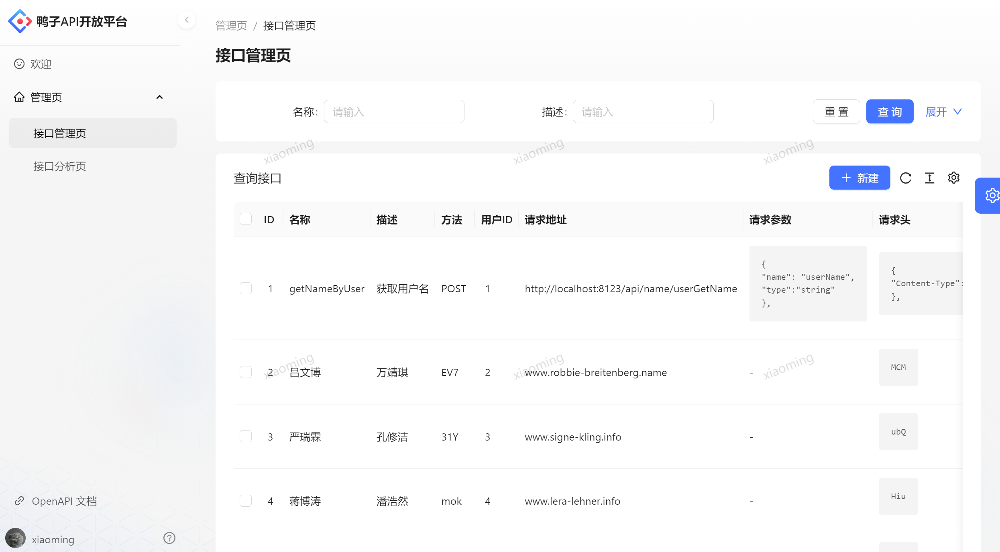

# 鸭子API项目

## 项目介绍
> 做一个提供API接口调用的平台，用户可以注册登录，开通接口调用权限。用户可以使用接口，并且每次调用会进行统计。管理员可以发布接口、下线接口、接入接口，以及可视化接口的调用情况、数据。

## 项目展示 
### 首页

### 后端
#### 接口调用页面

#### 接口管理页面

#### 接口分析页面

## 项目架构图

## 技术选型

### 前端
- React 18
- Ant Design Pro 5.x 脚手架
- Ant Design & Procomponents 组件库
- Umi 4 前端框架
- OpenAPI 前端代码生成

### 后端

- Java Spring Boot
- MySQL 数据库 
- MyBatis-Plus 及 MyBatis X 自动生成 
- API 签名认证（Http 调用） 
- Spring Boot Starter（SDK 开发） 
- Dubbo 分布式（RPC、Nacos） 
- Swagger + Knife4j 接口文档生成 
- Spring Cloud Gateway 微服务网关 
- Hutool、Apache Common Utils、Gson 等工具库

