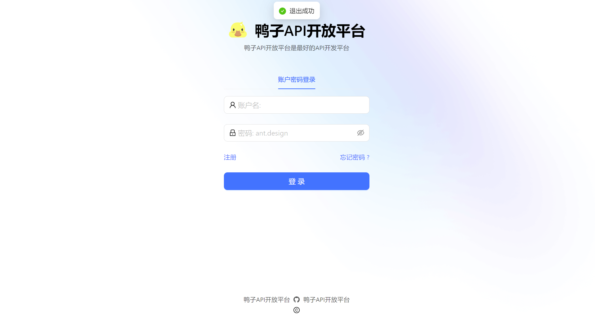

# 鸭子智能BI项目

## 项目介绍
> 基于Spring Boot + AIGC技术搭建的一款项目智能BI项目, 其区别于传统的BI，用户（数据分析者）只需要导入最原始的数据集，
> 输入想要进行分析的目标（比如帮我分析一下网站用户的增长趋势)， 就能利用AI自动生成一个符合要求的图表以及分析结论。
> 此外，还会有图表管理、异步生成等功能。

## 项目展示 
### 首页

### 后端

## 需求分析
- 智能分析：用户输入目标和原始数据（图表类型），可以自动生成图表和分析结论
- 图表管理
- 图表生成的异步化（消息队列）
- 对接 AI 能力

## 项目架构图

### 基础流程
> 客户端输入分析诉求和原始数据，向业务后端发送请求。业务后端利用AI服务处理客户端数据，保持到数据库，并生成图表。处理后的数据由业务后端发送给AI服务，AI服务生成结果并返回给后端，最终将结果返回给客户端展示。

### 优化后的流程
> 优化流程（异步化）：客户端输入分析诉求和原始数据，向业务后端发送请求。业务后端将请求事件放入消息队列，并为客户端生成图表Id号，让要生成图表的客户端去排队，消息队列根据服务负载情况，定期检查进度，如果AI服务还能处理更多的图表生成请求，就向任务处理模块发送消息。
任务处理模块调用AI服务处理客户端数据，AI 服务异步生成结果返回给后端并保存到数据库，当后端的AI工服务生成完毕后，可以通过向前端发送通知的方式，或者通过业务后端监控数据库中图表生成服务的状态，来确定生成结果是否可用。若生成结果可用，前端即可获取并处理相应的数据，最终将结果返回给客户端展示。在此期间，用户可以去做自己的事情。

## 技术选型

### 前端
- React 
- Umi
- Ant Design Pro
- 可视化开发库：Echarts √ 、HighChairts + AntV
- umi openapi 代码生成：自动生成后端调用代码
- EChart 图表生成

### 后端

- Spring Boot 2.7
- MySQL数据库
- Redis：Redissson限流控制
- MyBatis Plus 数据库访问结构
- 消息队列：RabbitMQ
- AI能力：Open AI接口开发
- Excel上传和数据的解析：Easy Excel
- Swagger + Knife4j 项目文档
- Hutool 工具库

### 工具类

- Easy Excel 表格处理
- Hutool 工具库
- Gson 解析库
- Apache Commons Lang3 工具类
- Lombok 注解

### 业务特性

- Spring Session Redis 分布式登录
- 全局请求响应拦截器（记录日志）
- 全局异常处理器
- 自定义错误码
- 封装通用响应类
- Swagger + Knife4j 接口文档
- 自定义权限注解 + 全局校验
- 全局跨域处理
- 长整数丢失精度解决
- 多环境配置

